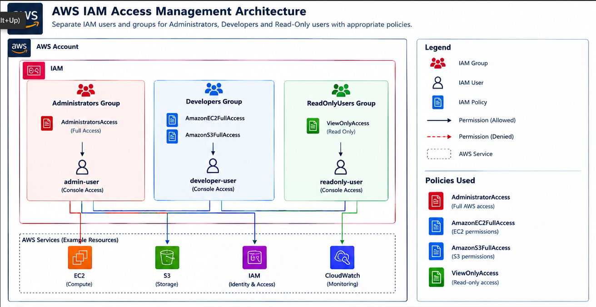
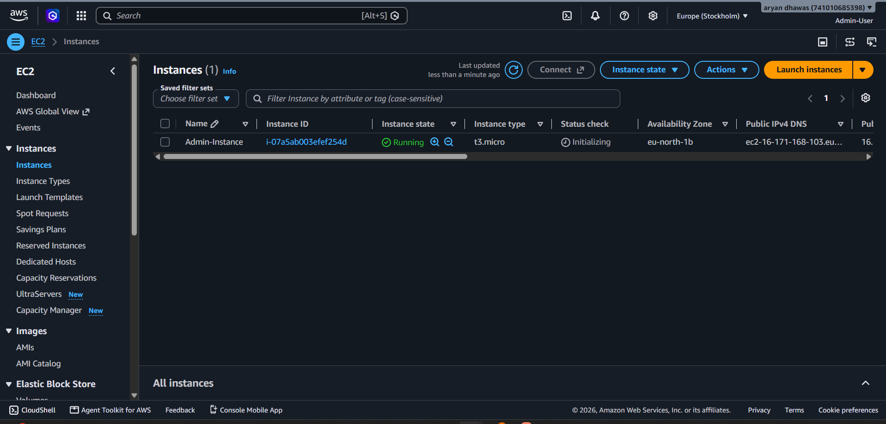
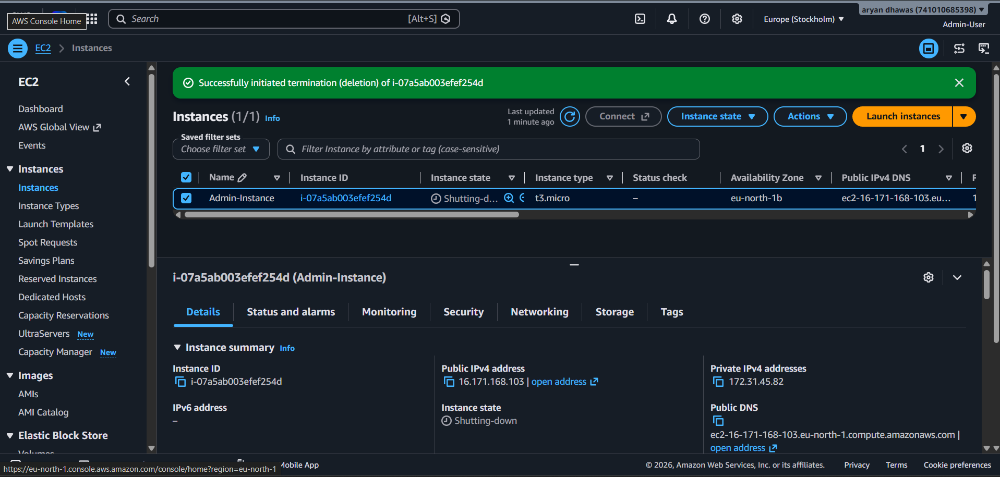
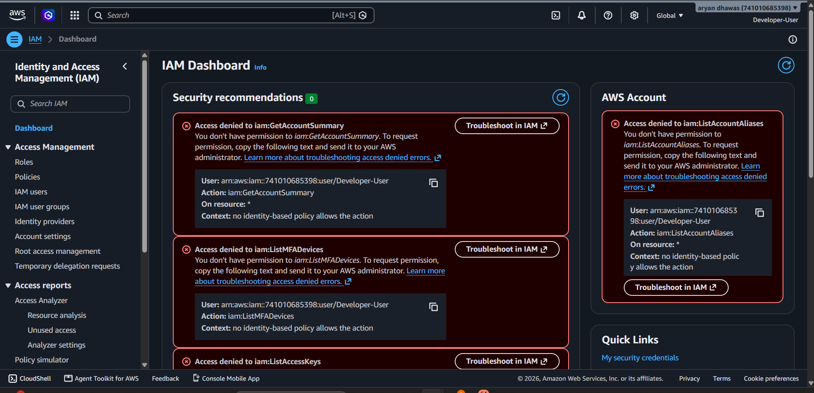
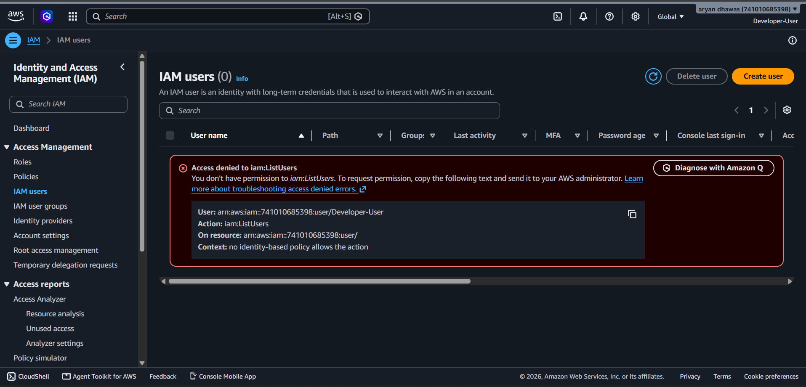
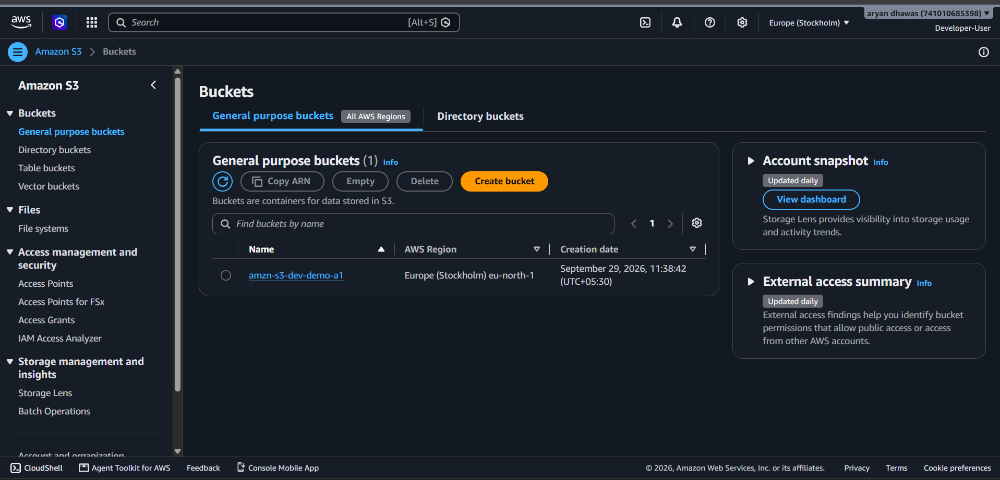
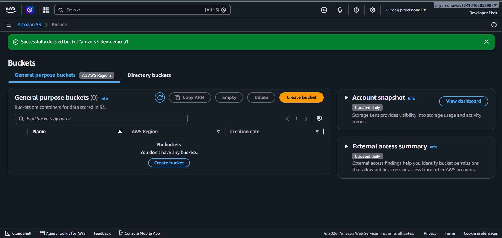
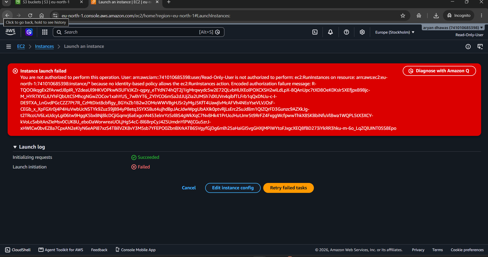
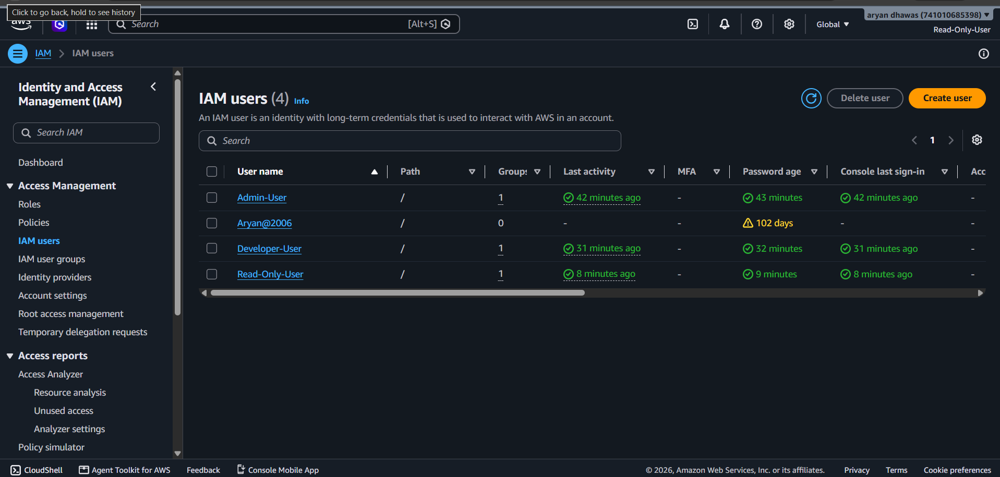

# AWS IAM-Based Access Management Environment

## Project Overview

This project demonstrates an **AWS Identity and Access Management (IAM)-based access management environment** for an organization. The environment separates users according to their responsibilities and applies role-appropriate IAM policies.

The implementation contains three access levels:

- **Administrators** — full AWS access for administrative operations.
- **Developers** — permissions focused on development resources such as EC2 and S3.
- **Read-Only Users** — view-only access without permission to perform resource-changing operations.

The project also demonstrates the difference between **permitted** and **denied** AWS operations using the AWS Management Console and captured evidence.

---

## Objectives

1. Create separate IAM users for different organizational responsibilities.
2. Create IAM groups for Administrators, Developers, and Read-Only Users.
3. Attach appropriate AWS managed policies to each group.
4. Assign users to their respective groups.
5. Demonstrate that administrators can perform privileged AWS operations.
6. Demonstrate that developers can access development services while lacking unrelated IAM administration permissions.
7. Demonstrate that read-only users can view AWS resources but cannot perform write operations.
8. Verify the access model using AWS Console screenshots.

---

# Architecture



### Architecture Components

| IAM Group | Example User | Policies | Intended Access |
|---|---|---|---|
| **Administrators Group** | `Admin-User` | `AdministratorAccess` | Full AWS access |
| **Developers Group** | `Developer-User` | `AmazonEC2FullAccess`, `AmazonS3FullAccess` | EC2 and S3 development operations |
| **ReadOnlyUsers Group** | `Read-Only-User` | `ViewOnlyAccess` | Read-only visibility |

### Access Flow

```text
AWS Account
│
└── IAM
    │
    ├── Administrators Group
    │   └── AdministratorAccess
    │       └── Admin-User
    │
    ├── Developers Group
    │   ├── AmazonEC2FullAccess
    │   └── AmazonS3FullAccess
    │       └── Developer-User
    │
    └── ReadOnlyUsers Group
        └── ViewOnlyAccess
            └── Read-Only-User
```

---

# 1. IAM User and Group Design

The environment separates permissions using IAM groups rather than assigning broad permissions independently to every user.

### Administrator

The administrator account is intended for privileged management operations and is associated with the `Administrators Group`.

**Policy:** `AdministratorAccess`

This provides broad access to AWS services and allows administrative operations such as managing compute resources, storage resources, and IAM configuration.

### Developer

The developer account is associated with the `Developers Group`.

**Policies:**

- `AmazonEC2FullAccess`
- `AmazonS3FullAccess`

This allows the developer to work with EC2 and S3 while not automatically granting full IAM administration permissions.

### Read-Only User

The read-only account is associated with the `ReadOnlyUsers Group`.

**Policy:** `ViewOnlyAccess`

This is intended to provide visibility into AWS resources without granting permissions to create, modify, or delete resources.

---

# 2. Administrator Access Demonstration

## 2.1 EC2 Instance Running

The administrator successfully has an EC2 instance named **`Admin-Instance`** in the AWS console.

The screenshot shows:

- Instance name: `Admin-Instance`
- Instance ID: `i-07a5ab003efef254d`
- Instance state: **Running**
- Instance type: `t3.micro`
- Availability Zone: `eu-north-1b`
- AWS Region: **Europe (Stockholm) / `eu-north-1`**
- Public IPv4 address: `16.171.168.103`



This demonstrates that the administrative user was able to manage an EC2 instance successfully.

---

## 2.2 EC2 Instance Termination

The administrator then initiated termination of the same EC2 instance.

The AWS Console displayed a successful termination initiation message and the instance entered the **Shutting-down** state.



### Result

The EC2 lifecycle operation demonstrates that the administrator had permission to perform a destructive compute operation.

**Operation demonstrated:** EC2 instance termination  
**Result:** **Allowed**

> **Evidence note:** The screenshot captures the `Shutting-down` state immediately after termination was initiated. It is evidence of a successful termination request rather than a final `Terminated` state screenshot.

---

# 3. Developer Access Demonstration

The developer account was tested to verify that development permissions were separated from IAM administration permissions.

## 3.1 IAM Administrative Operations Denied

While logged in as **`Developer-User`**, AWS displayed access-denied messages for IAM operations.

The screenshot shows denied actions including:

- `iam:GetAccountSummary`
- `iam:ListMFADevices`
- `iam:ListAccessKeys`

The console states that no identity-based policy allows the requested actions.



### Result

The developer does not have the permissions required to perform these IAM account-management operations.

**Operation:** IAM administrative/account operations  
**Result:** **Denied**

This is consistent with the project architecture because the developer group receives EC2 and S3 permissions rather than the full `AdministratorAccess` policy.

---

## 3.2 IAM User Listing Denied

A second test was performed from the IAM Users section while logged in as `Developer-User`.

AWS returned:

- **Access denied to `iam:ListUsers`**
- Context: no identity-based policy allows the action



### Result

The developer cannot enumerate IAM users through `iam:ListUsers`.

**Operation:** `iam:ListUsers`  
**Result:** **Denied**

This further demonstrates that the developer's access is restricted from IAM user-management functions.

---

# 4. Developer S3 Access Demonstration

The developer environment also includes S3 permissions through the `AmazonS3FullAccess` policy.

## 4.1 S3 Bucket Created

The S3 console shows a general-purpose bucket named:

`amzn-s3-dev-demo-a1`

The bucket is located in:

**Europe (Stockholm) — `eu-north-1`**



### Result

The S3 bucket screenshot provides evidence of S3 resource access in the development workflow.

**Resource:** `amzn-s3-dev-demo-a1`  
**Region:** `eu-north-1`  
**Operation demonstrated:** S3 bucket management

---

## 4.2 S3 Bucket Deleted

The bucket was subsequently deleted, and AWS displayed the confirmation:

> Successfully deleted bucket `amzn-s3-dev-demo-a1`



### Result

The S3 lifecycle operation demonstrates that the tested S3 management operation was permitted.

**Operation:** Delete S3 bucket  
**Result:** **Allowed**

---

# 5. Read-Only Access Demonstration

The read-only user is associated with the **`ReadOnlyUsers Group`** and uses the `ViewOnlyAccess` policy.

The purpose of this account is to inspect AWS resources without being able to create or modify them.

## 5.1 EC2 Launch Operation Denied

The read-only user attempted to launch an EC2 instance.

AWS returned an authorization error stating that:

- User: `Read-Only-User`
- Action: `ec2:RunInstances`
- The requested operation was not authorized.
- No identity-based policy allows the `ec2:RunInstances` action.



### Result

The read-only account cannot launch EC2 instances.

**Operation:** `ec2:RunInstances`  
**Result:** **Denied**

This is the expected behavior for a view-only access model.

---

## 5.2 IAM User Visibility

The IAM Users page was also accessed using the read-only account.

The console displayed the IAM user list containing entries such as:

- `Admin-User`
- `Aryan@2006`
- `Developer-User`
- `Read-Only-User`



The screenshot demonstrates the distinction between **view permission** and **modification permission**: the read-only account can view IAM information while the attempted EC2 creation operation is denied.

---

# 6. Permission Comparison

The following table summarizes the access model demonstrated in this project.

| Operation | Administrator | Developer | Read-Only |
|---|:---:|:---:|:---:|
| View AWS resources | Allowed | Allowed where policy permits | Allowed |
| Manage EC2 | Allowed | Allowed | Denied |
| Manage S3 | Allowed | Allowed | Denied |
| Launch EC2 (`ec2:RunInstances`) | Allowed | Allowed | **Denied** |
| Terminate EC2 | Allowed | Allowed where EC2 policy permits | Denied |
| IAM user administration | Allowed | **Denied** | Read-only visibility |
| `iam:ListUsers` | Allowed | **Denied** | View-only access |
| IAM account/admin operations | Allowed | **Denied** | Denied for modification |

> The table describes the permissions represented by the attached policies and the operations demonstrated in the supplied screenshots. Exact access to an individual AWS action can also be affected by resource policies, permission boundaries, SCPs, session policies, and other account-level controls.

---

# 7. Policies Used

## AdministratorAccess

**Purpose:** Full administrative access across AWS services.  
**Assigned to:** Administrators Group

```text
Administrators Group
        │
        └── AdministratorAccess
                │
                └── Admin-User
```

## AmazonEC2FullAccess

**Purpose:** Full access to Amazon EC2 operations covered by the managed policy.  
**Assigned to:** Developers Group

```text
Developers Group
        │
        └── AmazonEC2FullAccess
                │
                └── Developer-User
```

## AmazonS3FullAccess

**Purpose:** Full access to Amazon S3 operations covered by the managed policy.  
**Assigned to:** Developers Group

```text
Developers Group
        │
        └── AmazonS3FullAccess
                │
                └── Developer-User
```

## ViewOnlyAccess

**Purpose:** Provides view-only access to AWS resources without general resource modification permissions.  
**Assigned to:** ReadOnlyUsers Group

```text
ReadOnlyUsers Group
        │
        └── ViewOnlyAccess
                │
                └── Read-Only-User
```

---

# 8. Evidence and Verification

| Evidence | Screenshot | What It Demonstrates |
|---|---|---|
| Administrator EC2 access | `Admin-Instance-1.png` | `Admin-Instance` is running successfully |
| Administrator termination | `Admin-Instance-2.png` | EC2 termination was successfully initiated |
| Developer IAM restrictions | `Dev-Access-1.png` | IAM administrative actions are denied |
| Developer IAM user restriction | `Dev-Access-2.png` | `iam:ListUsers` is denied |
| Developer S3 access | `Dev-S3-1.png` | Development S3 bucket is present |
| Developer S3 deletion | `Dev-S3-2.png` | S3 bucket deletion was successful |
| IAM architecture | `Project1-Archi.png` | Groups, users, policies, and services are separated |
| Read-only EC2 restriction | `Read-1.png` | `ec2:RunInstances` is denied |
| Read-only IAM visibility | `Read-2.png` | IAM user information is visible to the read-only account |

---

# 9. Security Design

This project follows the principle of **least privilege** by separating permissions according to user responsibilities.

### Administrator

```text
Admin-User
    ↓
Administrators Group
    ↓
AdministratorAccess
    ↓
Broad AWS access
```

### Developer

```text
Developer-User
    ↓
Developers Group
    ├── AmazonEC2FullAccess
    └── AmazonS3FullAccess
```

The screenshots demonstrate that this does not automatically provide IAM administrative permissions.

### Read-Only User

```text
Read-Only-User
    ↓
ReadOnlyUsers Group
    ↓
ViewOnlyAccess
    ↓
View resources
    ↓
Resource creation/modification denied
```

---

# 10. Demonstrated Allowed vs Denied Operations

## Allowed Operations Demonstrated

### Administrator

- EC2 instance successfully running.
- EC2 termination successfully initiated.

### Developer

- S3 development bucket is present.
- S3 bucket deletion successfully completed.

## Denied Operations Demonstrated

### Developer

- `iam:GetAccountSummary` — denied.
- `iam:ListMFADevices` — denied.
- `iam:ListAccessKeys` — denied.
- `iam:ListUsers` — denied.

### Read-Only User

- `ec2:RunInstances` — denied.

These tests show that users with different IAM policies receive different levels of access.

---

# 11. Project Workflow

```text
1. Create IAM Groups
        ↓
2. Create IAM Users
        ↓
3. Attach Policies to Groups
        ↓
4. Add Users to Appropriate Groups
        ↓
5. Login as Administrator
        ↓
6. Test EC2 Management
        ↓
7. Login as Developer
        ↓
8. Test EC2/S3 Development Access
        ↓
9. Test IAM Administrative Restrictions
        ↓
10. Login as Read-Only User
        ↓
11. Verify Resource Visibility
        ↓
12. Attempt EC2 Launch
        ↓
13. Confirm Access Denied
```

---

# 12. Final Result

The completed AWS IAM environment demonstrates **role-based access control** using separate groups, users, and policies.

The project illustrates the difference between:

- **Full administrative access**
- **Service-specific developer access**
- **Read-only visibility**

The supplied AWS Console evidence shows both successful operations and explicit authorization failures, confirming that access is being controlled according to the assigned IAM policies.

---

# 13. Project File Structure

Keep the screenshots in the same directory as this `README.md` file so the Markdown images render correctly:

```text
README.md
Admin-Instance-1.png
Admin-Instance-2.png
Dev-Access-1.png
Dev-Access-2.png
Dev-S3-1.png
Dev-S3-2.png
Project1-Archi.png
Read-1.png
Read-2.png
```

---

## Technologies and AWS Services

- **Amazon Web Services (AWS)**
- **AWS IAM**
- **Amazon EC2**
- **Amazon S3**
- **Amazon CloudWatch**
- **IAM Groups**
- **IAM Users**
- **AWS Managed IAM Policies**
- **AWS Management Console**

---

## Conclusion

This project provides a practical demonstration of AWS IAM-based access management for an organization. By separating users into administrator, developer, and read-only groups and assigning policies according to their responsibilities, the environment demonstrates controlled access to AWS resources.

The captured tests provide concrete evidence of both **successful authorized operations** and **explicitly denied operations**, making the project a complete demonstration of IAM-based access control and least-privilege concepts.
