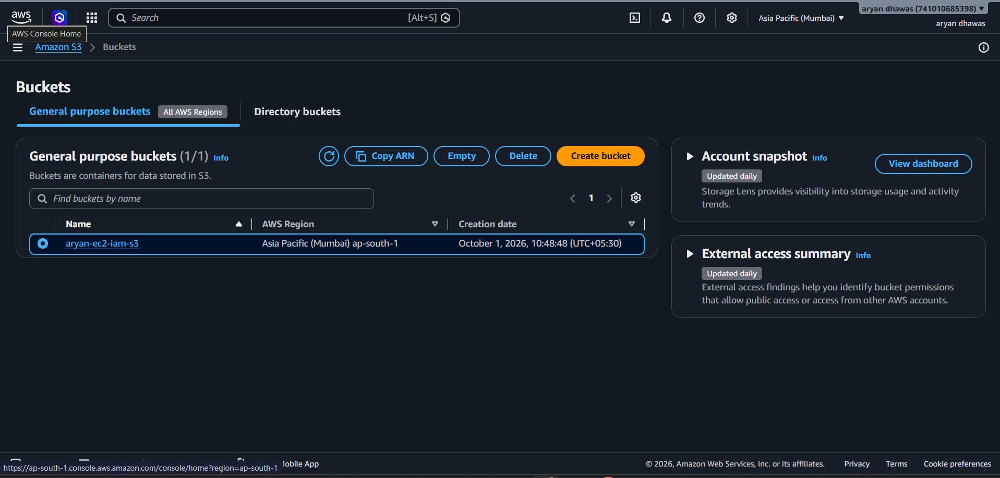

# AWS IAM Role for EC2 – Secure Amazon S3 Access

## Project Overview

This practical demonstrates how to securely allow an **Amazon EC2 instance to access an Amazon S3 bucket without storing AWS access keys or secret keys on the server**.

The solution uses an **IAM Role attached to the EC2 instance**. The AWS CLI running on the EC2 instance automatically obtains temporary credentials from the instance role.

### Architecture

```text
                         AWS Account
                              |
                 +------------+------------+
                 |                         |
              IAM Role                  Amazon S3
        ec2-s3-Access-Role          aryan-ec2-iam-s3
                 |                         |
                 |                    Test.pdf.txt
                 |                         |
                 +---------- EC2 ---------+
                            |
                       AWS CLI / SDK
                            |
                 Temporary IAM credentials
```

## Objectives

- Create an S3 bucket.
- Create an IAM policy for S3 access.
- Create an IAM role trusted by EC2.
- Attach the policy to the role.
- Launch an EC2 instance with the IAM role.
- Verify the role from the EC2 terminal.
- Access the S3 bucket using AWS CLI.
- Demonstrate that unauthorized S3 operations are denied.
- Access S3 without configuring permanent AWS access keys on the EC2 server.

---

## 1. Create the S3 Bucket

An S3 bucket named:

```text
aryan-ec2-iam-s3
```

was created in:

```text
Asia Pacific (Mumbai) – ap-south-1
```

The bucket contains the test object:

```text
Test.pdf.txt
```

### Screenshot



---

## 2. Create the IAM Policy

A customer-managed IAM policy named:

```text
ec2-s3-ReadAccess
```

was created for the EC2 workload.

The policy is intended to provide the required S3 permissions to the EC2 instance through an IAM role rather than through stored access keys.

### Screenshot


### Security Principle

The EC2 server does not need an IAM user's access key or secret access key. Permissions are associated with the IAM role and are made available to the instance through temporary credentials.

> **Note:** The exact S3 actions should match the practical requirement. For read-only access, permissions such as `s3:ListBucket` and `s3:GetObject` are sufficient. If an upload test is required, `s3:PutObject` must also be allowed.

---

## 3. Create the IAM Role for EC2

An IAM role named:

```text
ec2-s3-Access-Role
```

was created.

The role is configured so that **EC2 can assume the role**. This is visible in the IAM console where the trusted entity is shown as:

```text
AWS Service: ec2
```

### Screenshot


### Why use an IAM Role?

An IAM role provides temporary credentials to AWS workloads. This avoids putting long-lived AWS credentials directly into:

- source code
- shell scripts
- environment files
- EC2 configuration files

---

## 4. Attach the IAM Policy to the Role

The policy:

```text
ec2-s3-ReadAccess
```

is associated with:

```text
ec2-s3-Access-Role
```

The EC2 instance can then receive the permissions defined by the policy when it assumes the role.

### Permission Flow

```text
IAM Policy
    ↓
ec2-s3-Access-Role
    ↓
EC2 Instance
    ↓
Temporary Credentials
    ↓
Amazon S3
```

---

## 5. Launch the EC2 Instance

An Amazon EC2 instance was launched with the IAM role attached.

The instance shown in the practical is:

```text
Instance ID: i-04aebad7ba539b0ef
Name: ec2-s3-test-aryan
Instance type: t3.micro
Platform: Linux/UNIX
Availability Zone: ap-south-1b
```

The instance is shown in the **Running** state.

### Screenshot


### Important Step

When launching the EC2 instance, the IAM role must be selected under the instance's IAM role configuration.

The role used for this practical is:

```text
ec2-s3-Access-Role
```

---

## 6. Connect to the EC2 Instance

After the instance was launched, the server was accessed using the EC2 terminal.

The system is running:

```text
Amazon Linux 2023
```

The AWS CLI is available on the server.

The AWS CLI version shown in the practical is:

```text
aws-cli/2.34.47
```

---

## 7. Verify the AWS Identity Used by EC2

The following command was executed:

```bash
aws sts get-caller-identity
```

This command confirms which AWS identity is being used by the AWS CLI.

The output shows that the EC2 instance is using the assumed role:

```text
arn:aws:sts::741010685398:assumed-role/ec2-s3-Access-Role/i-04aebad7ba539b0ef
```

This is important evidence that the EC2 instance is using the IAM role rather than a manually configured IAM user's access key.

### Screenshot


---

## 8. Test S3 Access from EC2

The following command was used to list the contents of the S3 bucket:

```bash
aws s3 ls s3://aryan-ec2-iam-s3
```

The command successfully returned:

```text
2026-10-01 05:19:44          0 Test.pdf.txt
```

This proves that the EC2 instance can successfully access the S3 bucket using the attached IAM role.

---

## 9. Download an Object from S3

The following command was used:

```bash
aws s3 cp s3://aryan-ec2-iam-s3/Test.pdf.txt .
```

The object was successfully downloaded to the EC2 server:

```text
download: s3://aryan-ec2-iam-s3/Test.pdf.txt to ./Test.pdf.txt
```

The local file was then confirmed with:

```bash
ls
```

which showed:

```text
Test.pdf.txt
```

---

## 10. Demonstrate Permission Enforcement

A test upload was attempted:

```bash
echo "hello from aryan" > upload.txt
```

Then:

```bash
aws s3 cp upload.txt s3://aryan-ec2-iam-s3/
```

The operation returned an **AccessDenied** error because the current IAM policy did not allow:

```text
s3:PutObject
```

for the requested S3 object.

### Screenshot


### What this proves

The AccessDenied result demonstrates that IAM permissions are being enforced.

The EC2 instance can perform the S3 operations granted by its role, while an operation not included in the role's permissions is rejected by AWS.

This is an important part of the practical because it demonstrates the difference between:

```text
Allowed operation  →  Successful
Denied operation   →  AccessDenied
```

---

## 11. No AWS Access Keys Stored on the Server

One of the main goals of this practical is to avoid storing permanent AWS credentials on the EC2 server.

The AWS CLI uses the EC2 instance role and obtains temporary credentials automatically.

The identity check:

```bash
aws sts get-caller-identity
```

confirms that the active identity is:

```text
assumed-role/ec2-s3-Access-Role
```

Therefore, the EC2 workload can authenticate to AWS services through the IAM role.

### Recommended Security Practice

Do **not** store credentials such as:

```text
AWS_ACCESS_KEY_ID
AWS_SECRET_ACCESS_KEY
```

inside application source code, scripts, or `.env` files on the EC2 server when an IAM role can be used instead.

---

## 12. Practical Result

The practical successfully demonstrates:

| Requirement | Result |
|---|---|
| S3 bucket created | ✅ Completed |
| IAM policy created | ✅ Completed |
| IAM role created | ✅ Completed |
| EC2 trusted entity configured | ✅ Completed |
| Role attached to EC2 | ✅ Completed |
| EC2 running | ✅ Completed |
| AWS identity verified | ✅ Completed |
| S3 bucket listing | ✅ Successful |
| S3 object download | ✅ Successful |
| Unauthorized upload tested | ✅ AccessDenied |
| Permanent access keys required on EC2 | ❌ No |

---

## 13. Complete Command Reference

### Check AWS CLI version

```bash
aws --version
```

### Verify the current AWS identity

```bash
aws sts get-caller-identity
```

### List S3 bucket contents

```bash
aws s3 ls s3://aryan-ec2-iam-s3
```

### Download an S3 object

```bash
aws s3 cp s3://aryan-ec2-iam-s3/Test.pdf.txt .
```

### Create a local test file

```bash
echo "hello from aryan" > upload.txt
```

### Test upload permission

```bash
aws s3 cp upload.txt s3://aryan-ec2-iam-s3/
```

If `s3:PutObject` is not included in the role policy, AWS returns:

```text
AccessDenied
```

---

## 14. Evidence Screenshots

The following screenshots are included with this README:

1. **S3 Bucket** – shows the `aryan-ec2-iam-s3` bucket.
2. **IAM Policy** – shows the `ec2-s3-ReadAccess` customer-managed policy.
3. **IAM Role** – shows `ec2-s3-Access-Role` with EC2 as the trusted service.
4. **EC2 Instance** – shows the running EC2 instance.
5. **Successful CLI Access** – shows `get-caller-identity` and successful S3 listing.
6. **AccessDenied Test** – shows the denied `PutObject` operation.

---

## 15. Conclusion

This practical demonstrates a secure AWS access pattern in which an EC2 instance accesses Amazon S3 through an **IAM role** instead of storing long-lived AWS access keys on the server.

The successful `aws s3 ls` and `aws s3 cp` commands demonstrate permitted access, while the `AccessDenied` response for `PutObject` demonstrates IAM permission enforcement.

The resulting architecture follows the principle of granting AWS workloads only the permissions required for their tasks and using IAM roles for EC2-based AWS service access.

---

## Technologies Used

- Amazon EC2
- Amazon S3
- AWS IAM
- IAM Roles
- IAM Policies
- AWS CLI
- Amazon Linux 2023

