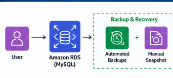
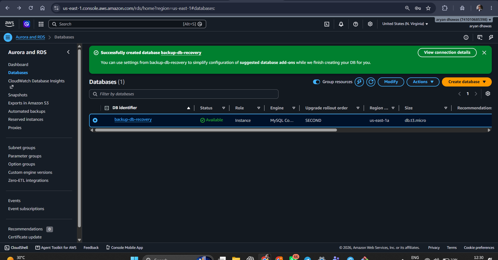
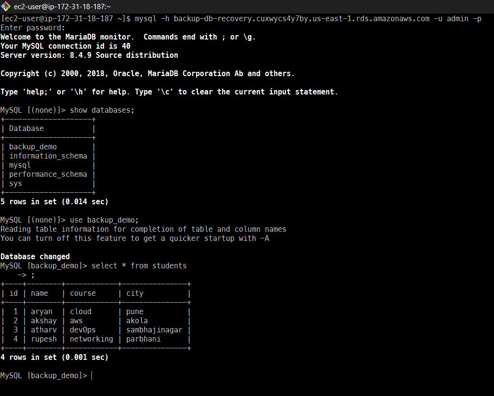
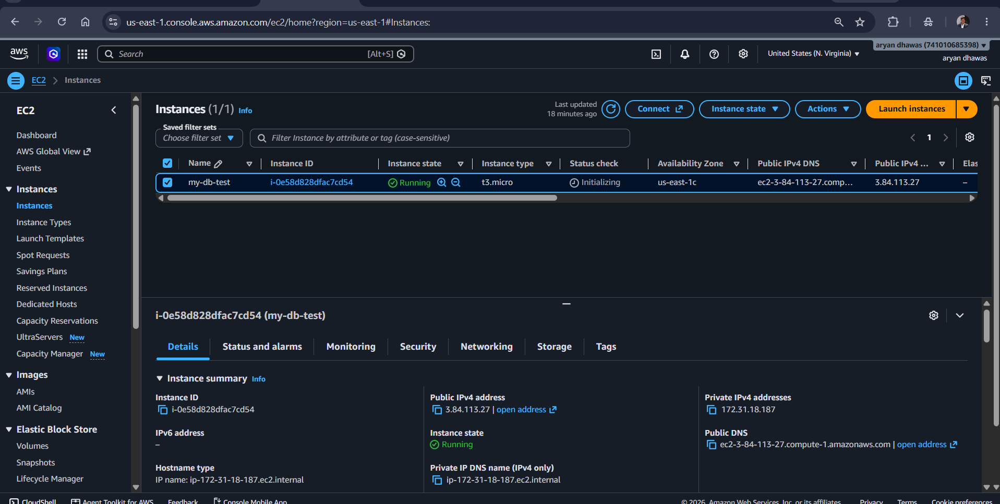
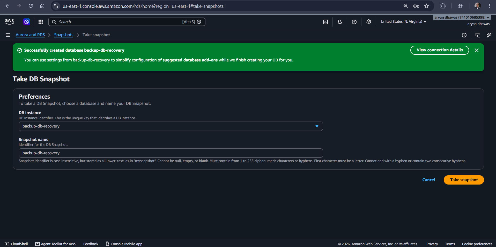
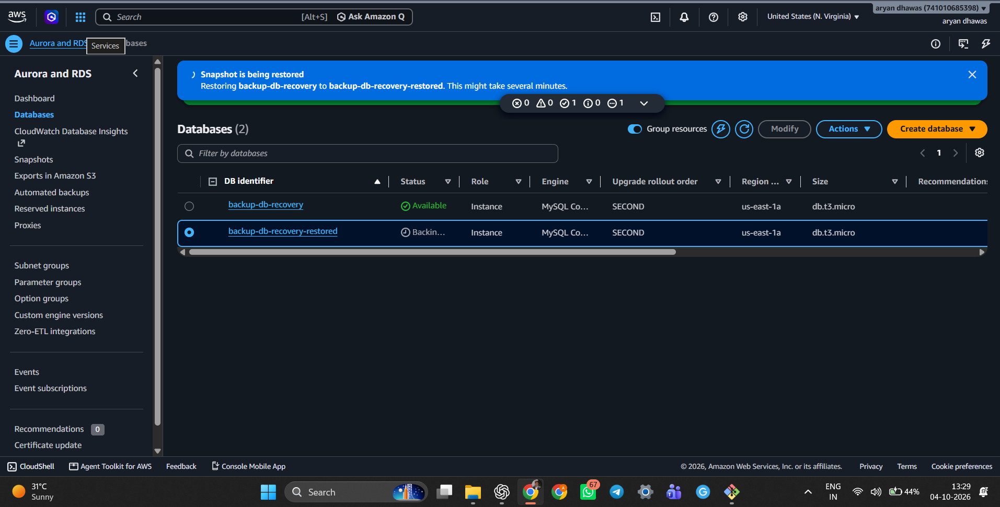
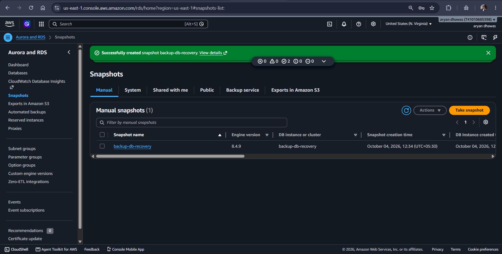
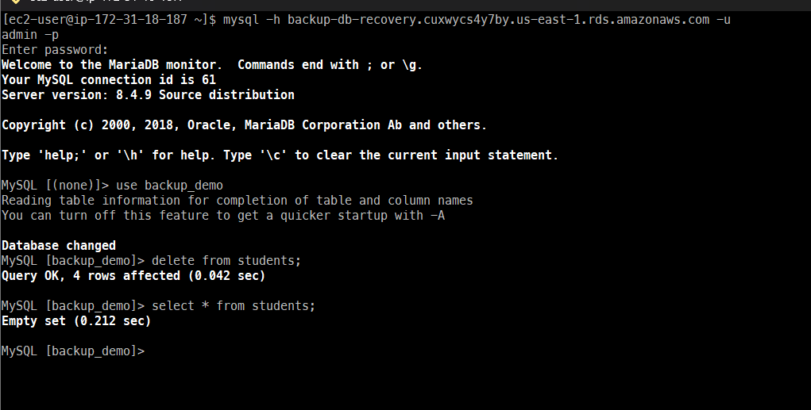
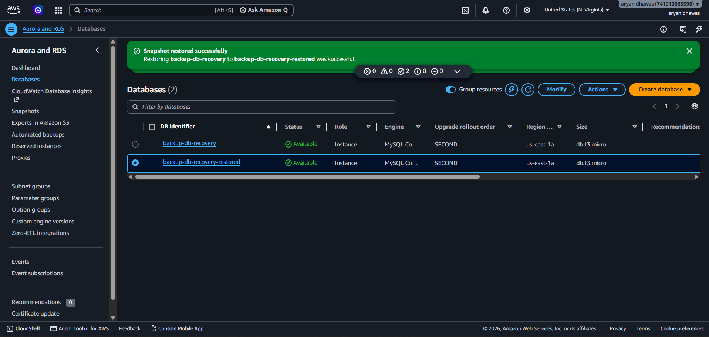
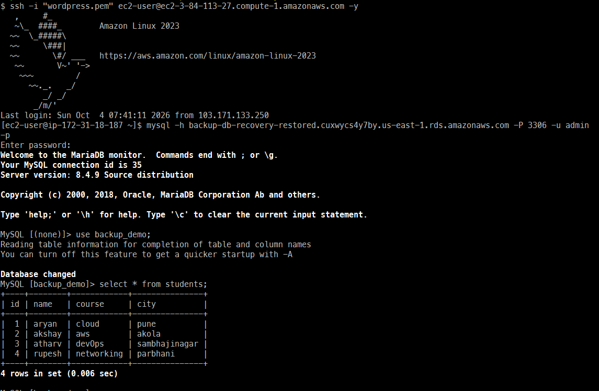

# Amazon RDS MySQL – Backup and Recovery

## 📌 Project Overview

This project demonstrates how to create an **Amazon RDS MySQL database** and implement a complete **backup and recovery scenario** using Amazon RDS backup and snapshot features.

The practical covers:

- Creating an Amazon RDS MySQL database.
- Configuring automated backups.
- Connecting to the RDS database from an Amazon EC2 instance.
- Creating a database and inserting sample records.
- Creating a manual RDS DB snapshot.
- Simulating data loss by deleting the sample records.
- Restoring the database from the manual snapshot.
- Connecting to the restored RDS instance.
- Verifying that the original records have been recovered successfully.

---

## 🏗️ Architecture

The overall architecture used in this practical is:

```text
                         ┌─────────────────────┐
                         │       User          │
                         └──────────┬──────────┘
                                    │
                                    ▼
                         ┌─────────────────────┐
                         │    Amazon EC2       │
                         │  Amazon Linux 2023  │
                         └──────────┬──────────┘
                                    │
                              MySQL/MariaDB
                                    │
                                    ▼
                    ┌─────────────────────────────┐
                    │      Amazon RDS MySQL       │
                    │       backup-db-recovery    │
                    └──────────────┬──────────────┘
                                   │
                     ┌─────────────┴─────────────┐
                     ▼                           ▼
              Automated Backups             Manual Snapshot
                     │                           │
                     └─────────────┬─────────────┘
                                   ▼
                         ┌─────────────────────┐
                         │  Restore from       │
                         │  Snapshot           │
                         └──────────┬──────────┘
                                    ▼
                    ┌─────────────────────────────┐
                    │ backup-db-recovery-restored │
                    └─────────────────────────────┘
```

### Architecture Diagram



---

# 1. Prerequisites

Before starting, make sure you have:

- An AWS account.
- AWS Management Console access.
- An Amazon EC2 instance.
- An Amazon RDS-supported MySQL database.
- MySQL/MariaDB client installed on the EC2 instance.
- Security group rules allowing the EC2 instance to connect to RDS on TCP port **3306**.
- RDS database credentials.

### AWS Services Used

| Service | Purpose |
|---|---|
| Amazon RDS | Managed MySQL database |
| Amazon EC2 | Client/server used to connect to RDS |
| RDS Automated Backups | Point-in-time backup capability |
| RDS Manual Snapshot | Manual backup used for recovery |
| AWS Console | Resource management |

---

# 2. Create the Amazon RDS MySQL Database

## Step 1: Open Amazon RDS

1. Sign in to the AWS Management Console.
2. Open **Amazon RDS**.
3. Select **Databases**.
4. Click **Create database**.

## Step 2: Select Database Engine

Choose:

- **Standard create**
- Engine: **MySQL**
- Select an appropriate MySQL version.

## Step 3: Configure the Database

Example configuration used in this practical:

- DB identifier: `backup-db-recovery`
- Instance class: `db.t3.micro`
- Storage: suitable lab/test storage
- Username: `admin`
- Password: your secure database password
- VPC: same VPC/network environment as the EC2 client where applicable
- Security group: allow MySQL/Aurora TCP `3306` from the EC2 security group or required source.

> **Security note:** Never publish your real database password in GitHub, README files, screenshots, or source code.

## Step 4: Create the Database

Review the settings and click **Create database**.

### Evidence – RDS Database Created



### Evidence – Main RDS Console



---

# 3. Verify the EC2 Instance

An Amazon Linux 2023 EC2 instance is used as the database client.

Example instance:

- Name: `my-db-test`
- Instance type: `t3.micro`
- Operating system: Amazon Linux 2023
- Public IPv4: shown in the AWS console
- Private IP: shown in the AWS console

### Evidence – EC2 Instance



Connect to the EC2 instance using SSH:

```bash
ssh -i "wordpress.pem" ec2-user@<EC2-PUBLIC-DNS> -y
```

Replace `<EC2-PUBLIC-DNS>` with the public DNS name of your EC2 instance.

---

# 4. Connect to Amazon RDS MySQL

From the EC2 instance, connect to the RDS endpoint:

```bash
mysql -h <RDS-ENDPOINT> -P 3306 -u admin -p
```

Example format:

```bash
mysql -h backup-db-recovery.<rds-endpoint> -u admin -p
```

Enter the RDS master password when prompted.

After a successful connection, the MariaDB/MySQL monitor should appear.

---

# 5. Configure Automated Backups

Automated backups provide a recovery mechanism for the RDS database.

In the RDS console:

1. Open **RDS → Databases**.
2. Select `backup-db-recovery`.
3. Choose **Modify**.
4. Find the **Backup** configuration.
5. Configure the backup retention period.
6. For this lab, a retention period such as **7 days** can be used.
7. Save the changes.

Automated backups allow RDS to retain backup information for point-in-time recovery within the configured retention period.

---

# 6. Create the Database and Sample Table

After connecting to RDS from the EC2 instance, create/select the sample database:

```sql
CREATE DATABASE backup_demo;
```

Select the database:

```sql
USE backup_demo;
```

Create the `students` table:

```sql
CREATE TABLE students (
    id INT PRIMARY KEY,
    name VARCHAR(100),
    course VARCHAR(100),
    city VARCHAR(100)
);
```

Insert sample records:

```sql
INSERT INTO students (id, name, course, city) VALUES
(1, 'aryan', 'cloud', 'pune'),
(2, 'akshay', 'aws', 'akola'),
(3, 'atharv', 'devops', 'sambhajinagar'),
(4, 'rupesh', 'networking', 'parbhani');
```

Verify the records:

```sql
SELECT * FROM students;
```

Expected sample data:

| ID | Name | Course | City |
|---:|---|---|---|
| 1 | aryan | cloud | pune |
| 2 | akshay | aws | akola |
| 3 | atharv | devops | sambhajinagar |
| 4 | rupesh | networking | parbhani |

---

# 7. Create a Manual DB Snapshot

A manual snapshot provides a point-in-time copy of the RDS database.

## Steps

1. Open **Amazon RDS**.
2. Go to **Databases**.
3. Select `backup-db-recovery`.
4. Choose **Actions → Take snapshot**.
5. Enter a snapshot name.

Example:

```text
backup-db-recovery
```

6. Click **Take snapshot**.
7. Wait until the snapshot status becomes available.

### Evidence – Snapshot Configuration



### Evidence – Snapshot Creation



### Evidence – Snapshot Created Successfully



---

# 8. Verify the Snapshot

Open:

**RDS → Snapshots → Manual**

The manually created snapshot should be visible.

The snapshot acts as the recovery point that will be used after simulating data loss.

---

# 9. Simulate Data Loss

To demonstrate recovery, the records in the `students` table are deleted.

Connect to the database:

```sql
USE backup_demo;
```

Delete the records:

```sql
DELETE FROM students;
```

Verify that the table is empty:

```sql
SELECT * FROM students;
```

Expected result:

```text
Empty set
```

### Evidence – Data Deleted



This demonstrates the simulated data-loss scenario.

> **Important:** The deletion is intentional for this lab. In a real production database, destructive commands should be carefully controlled.

---

# 10. Restore the RDS Database from Snapshot

Now recover the deleted data using the manual snapshot.

## Steps

1. Open **Amazon RDS**.
2. Select **Snapshots**.
3. Select the manual snapshot:
   `backup-db-recovery`
4. Click **Actions → Restore snapshot**.
5. Configure the restored database.
6. Enter a new DB identifier, for example:

```text
backup-db-recovery-restored
```

7. Review networking, security group, instance class, and storage settings.
8. Start the restore operation.
9. Wait until the restored RDS instance becomes **Available**.

### Evidence – Snapshot Restore in Progress



### Evidence – Restored Database Available



---

# 11. Verify the Restored Database

After the restored RDS instance becomes available, obtain its endpoint from the RDS console.

Connect from the EC2 instance:

```bash
mysql -h <RESTORED-RDS-ENDPOINT> -u admin -p
```

Select the database:

```sql
USE backup_demo;
```

Check the table:

```sql
SELECT * FROM students;
```

The original four records should be available again.

Expected result:

```text
+----+--------+------------+--------------+
| id | name   | course     | city         |
+----+--------+------------+--------------+
|  1 | aryan  | cloud      | pune         |
|  2 | akshay | aws        | akola        |
|  3 | atharv | devops     | sambhajinagar|
|  4 | rupesh | networking | parbhani     |
+----+--------+------------+--------------+
```

### Evidence – Recovered Records


---

# 12. Recovery Verification

The recovery is considered successful when:

- The restored RDS instance is **Available**.
- The `backup_demo` database exists.
- The `students` table exists.
- The records deleted during the simulation are present again.
- The restored data matches the data that existed when the snapshot was created.

The terminal output confirms that the four student records were successfully recovered.

---

# 13. Complete Practical Flow

```text
Create RDS MySQL
       │
       ▼
Configure Automated Backups
       │
       ▼
Connect from EC2
       │
       ▼
Create backup_demo database
       │
       ▼
Insert sample records
       │
       ▼
Create Manual Snapshot
       │
       ▼
Simulate Data Loss
       │
       ▼
Delete Sample Records
       │
       ▼
Restore RDS from Snapshot
       │
       ▼
Connect to Restored Database
       │
       ▼
SELECT * FROM students
       │
       ▼
Records Successfully Recovered
```

---

# 14. Screenshots / Practical Evidence

## RDS Database


## EC2 Instance


## Main RDS Console


## Snapshot Configuration


## Snapshot Creation


## Snapshot Created


## Database Data Deleted


## Snapshot Restored


## Database Restored


---

# 15. Commands Used

### Connect to RDS

```bash
mysql -h <RDS-ENDPOINT> -P 3306 -u admin -p
```

### Create Database

```sql
CREATE DATABASE backup_demo;
```

### Select Database

```sql
USE backup_demo;
```

### Create Table

```sql
CREATE TABLE students (
    id INT PRIMARY KEY,
    name VARCHAR(100),
    course VARCHAR(100),
    city VARCHAR(100)
);
```

### Insert Records

```sql
INSERT INTO students (id, name, course, city) VALUES
(1, 'aryan', 'cloud', 'pune'),
(2, 'akshay', 'aws', 'akola'),
(3, 'atharv', 'devops', 'sambhajinagar'),
(4, 'rupesh', 'networking', 'parbhani');
```

### Verify Records

```sql
SELECT * FROM students;
```

### Simulate Data Loss

```sql
DELETE FROM students;
```

### Verify Data Loss

```sql
SELECT * FROM students;
```

### Verify Recovery

```sql
SELECT * FROM students;
```

---

# 16. Backup and Recovery Strategy

| Feature | Purpose |
|---|---|
| Automated Backup | Supports point-in-time recovery |
| Manual Snapshot | Creates a user-controlled recovery point |
| RDS Restore | Creates a new DB instance from a snapshot |
| EC2 + MySQL Client | Used to test database connectivity |
| Security Group | Controls access to MySQL port 3306 |

---

# 17. Result

The Amazon RDS MySQL backup and recovery practical was completed successfully.

The following activities were demonstrated:

- ✅ Amazon RDS MySQL database created.
- ✅ Automated backup configuration completed.
- ✅ Sample database and records created.
- ✅ Manual DB snapshot created.
- ✅ Data loss simulated by deleting records.
- ✅ RDS database restored from the snapshot.
- ✅ Restored database connected successfully.
- ✅ Original records verified after recovery.

---

# 18. Key Takeaways

- **Automated backups** help protect RDS databases against accidental data loss and support point-in-time recovery.
- **Manual snapshots** provide a specific recovery point that can be retained independently.
- Restoring a snapshot creates a **new RDS DB instance** rather than overwriting the original instance.
- Database backups should be tested periodically to ensure that recovery procedures work as expected.
- Access to RDS should be restricted using appropriate VPC and security-group rules.

---

# 19. Conclusion

This practical successfully demonstrates an end-to-end **Amazon RDS MySQL backup and recovery workflow**.

A MySQL database was created on Amazon RDS, automated backups were configured, sample records were inserted, and a manual snapshot was created. The records were then intentionally deleted to simulate data loss. Finally, the RDS database was restored from the snapshot and the original records were successfully verified.

This demonstrates how Amazon RDS backup and snapshot capabilities can be used to improve **data durability, disaster recovery, and operational resilience**.

---

## 👨‍💻 Project

**Project:** Amazon RDS MySQL Backup and Recovery  
**Cloud Platform:** Amazon Web Services (AWS)  
**Database:** MySQL / MariaDB client  
**Compute:** Amazon EC2  
**Primary Service:** Amazon RDS  

